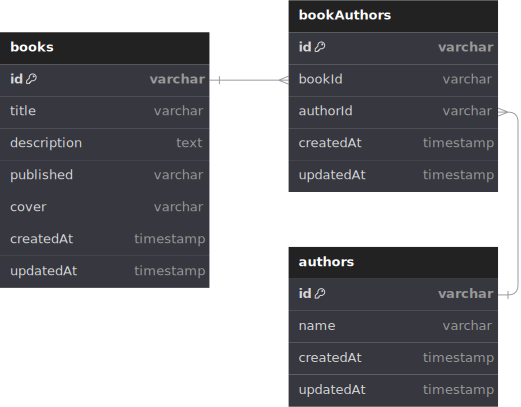

# Bücherliste (Book List)

Backend API which showing best seller book recommendations to feed your thirsty brain.

## REST API Specification

- Production: `https://bucherliste.ridoatmanto.com`
- Local: `http://localhost:3000`

| Endpoint     | HTTP     | Description        |
| ------------ | -------- | ------------------ |
| `/books`     | `GET`    | Get all books      |
| `/books/:id` | `GET`    | Get book by id     |
| `/books`     | `POST`   | Add new book       |
| `/books`     | `DELETE` | Delete all books   |
| `/books/:id` | `DELETE` | Delete book by id  |
| `/books/:id` | `PUT`    | Update books by id |

## ERD



## Tech Stack

- Hono
- Bun
- TypeScript
- Docker
- PostgreSQL
- Prisma
- Render
- CloudFlare
- VSCode

## How to run this project (with `bun`)

To install dependencies:

```sh
bun install
```

To run:

```sh
bun run dev
```

then open `http://localhost:3000`

## Futhermore Information

Another detail or something to discuss please contact me on Telegram on [t.me/ridoatmanto](https://t.me/ridoatmanto).

## JSON output preview:

```json
[
  {
    "id": "xpv1v",
    "title": "80/20 Sales and Marketing: The Definitive Guide to Working Less and Making More",
    "description": "Stop \"Just Getting By\"... Master the 80/20 Rule. Apply the Pareto Principle to Business And Make More Money Without More Work.\n\nWhen you know how to walk into any situation and see the 80/20's, the 80/20 Principle can solve almost ANY conversion problem.\n\nAny traffic problem.\n\nAny money problem.\nPerry Marshall has something original and extremely useful to say,because he has thought profoundly about the 80/20 Principle. He has come up with some original insights that are literally priceless. You really can change your business and your life.",
    "authors": [
      {
        "id": "author-rfwp2",
        "name": "Perry Marshall"
      },
      {
        "id": "author-cfha0",
        "name": "Richard Koch"
      }
    ],
    "publised": "Aug 13, 2013",
    "cover": "https://bucherlister.ridoatmanto.com/public/books-cover/80-20-sales-and-marketing.png",
    "createdAt": "2024-06-16T04:52:11.189Z",
    "updatedAt": "2024-06-16T04:52:11.189Z"
  },
  {
    "id": "tbvxk",
    "title": "Sales Funnel Sabotage: Are These 10 Common Mistakes Holding Your Business Back? (The Internet Marketing Starter Pack Book 3)",
    "description": "Are your sales funnels underperforming? Are you struggling to identify what's holding your business back?\n\nUncover the secrets to maximizing your sales funnel effectiveness with \"Sales Funnel Sabotage.\"\n\nThis insightful book shines a spotlight on the pitfalls that could be costing your business BIG, and reveals how you can turn the tables on the common mistakes entrepreneurs often make.",
    "authors": [
      {
        "id": "author-kfso9",
        "name": "Miles Beckler"
      }
    ],
    "publised": "July 24, 2023",
    "cover": "https://bucherlister.ridoatmanto.com/public/books-cover/sales-funnel-sabotage.png",
    "createdAt": "2024-06-16T04:52:11.189Z",
    "updatedAt": "2024-06-16T04:52:11.189Z"
  }
]
```

---

Created © 2024 by [Rido Atmanto](https://ridoatmanto.com)
